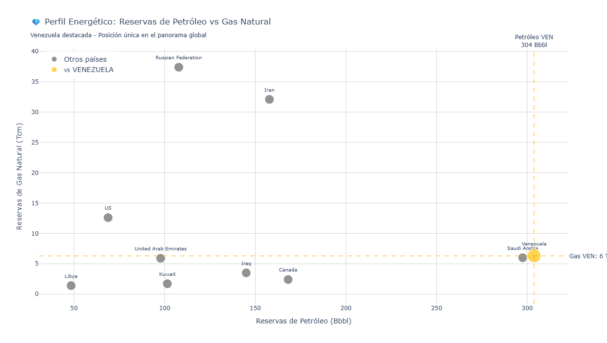
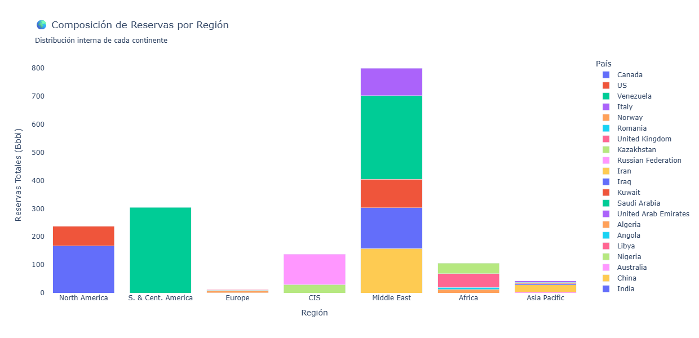
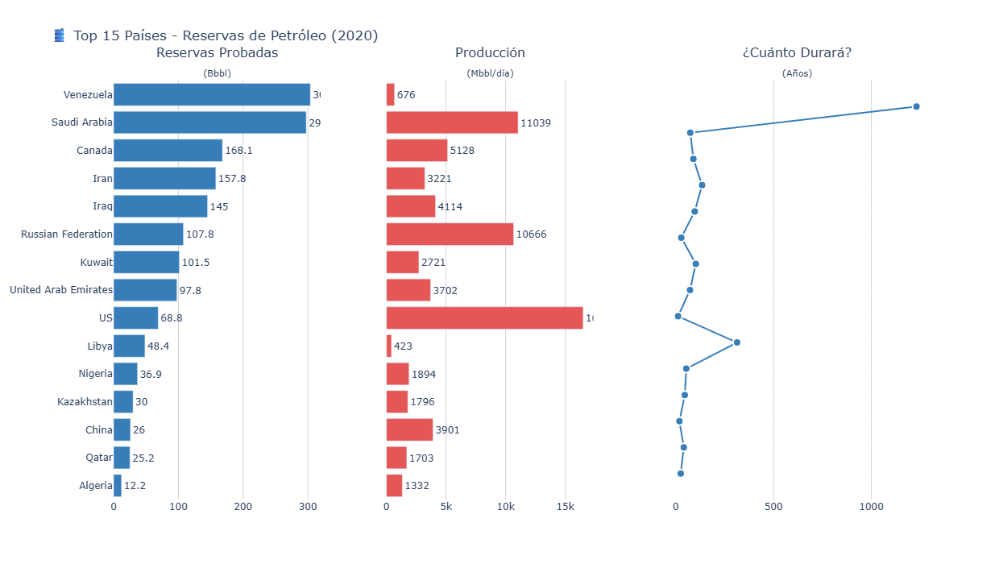
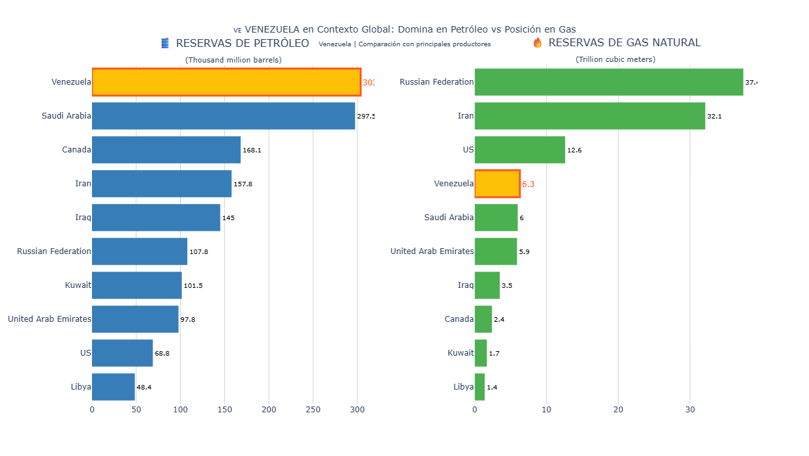
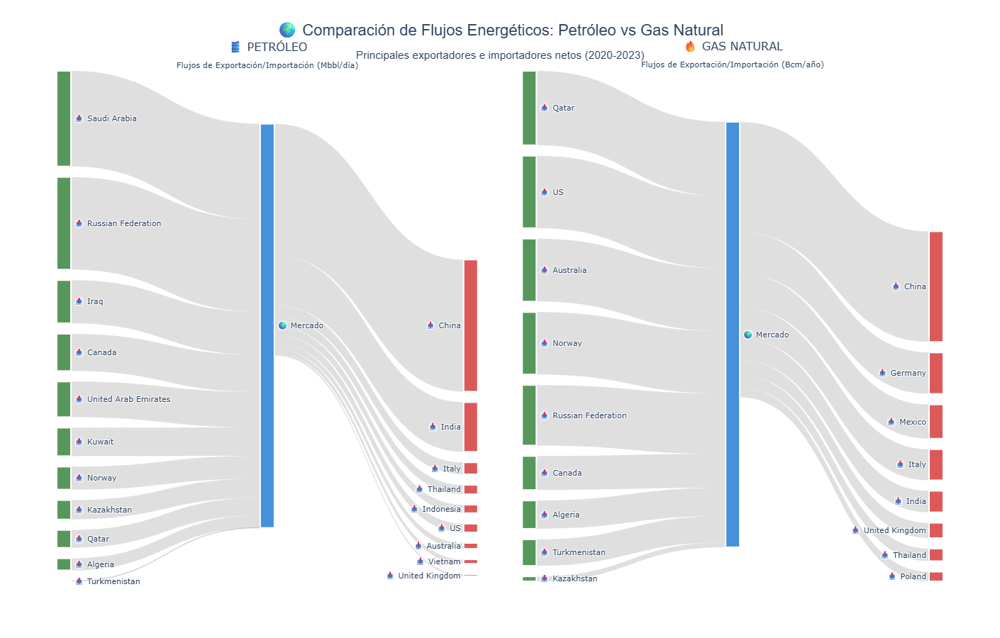

# Oil & Gas Reserves Analysis

This repository presents an exploratory and descriptive analysis of **oil and gas reserves** using Python and data science techniques.  
The objective is to analyze reserves distribution, regional patterns, and comparative insights between oil and gas resources.

The project is designed as a **research-oriented data analysis**, suitable for academic, energy sector

---

## 📊 Key Visualizations

The following figures summarize the main analytical outputs of the project.

### 1. Oil vs Gas Reserves Comparison
Comparison between oil and gas reserves to highlight structural differences in resource availability.

---

### 2. Oil Reserves by Region
Geographical distribution of oil reserves across regions.

---

### 3. Top 15 Countries by Oil Reserves
Ranking of the top 15 countries based on proven oil reserves.

---

### 4. Reserves Distribution – Bar Chart
Bar chart visualization showing reserves distribution across selected entities.

---

### 5. Sankey Diagram – Global Reserves Flow
Sankey diagram illustrating relationships and flows in global oil and gas reserves.

---

## 📂 Repository Structure

oil-gas_reserves_analysis/
│
├── Analisis_FINAL_4_Modulos.ipynb # Main analysis notebook
├── data/ # Raw and processed datasets
├── examples/ # Generated figures and visual outputs
├── requirements.txt # Python dependencies
└── README.md # Project documentation

